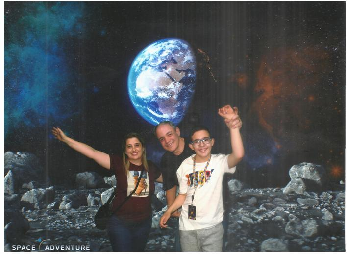

## Quem sou eu?
Olá :-)  
Eu me chamo **Flaris Roland Feller** 
1. Um homem de família 
1. Apaixonado por tecnologia 
1. Mestre em Ciência da Computação - BD e Big Data 
1. MBA em Gerenciamento de Projetos 
1. Graduado em Ciências da Computação 
1. Pesquisador na UFSC/INE 
1. Há 29 anos atuando profissionalmente na área da TI 
1. Atuação em empresas de Florianópolis 

Áreas:
* Banco de Dados 
* Desenvolvimento 
* DevOps

  

email: flaris.feller@unicesusc.edu.br
